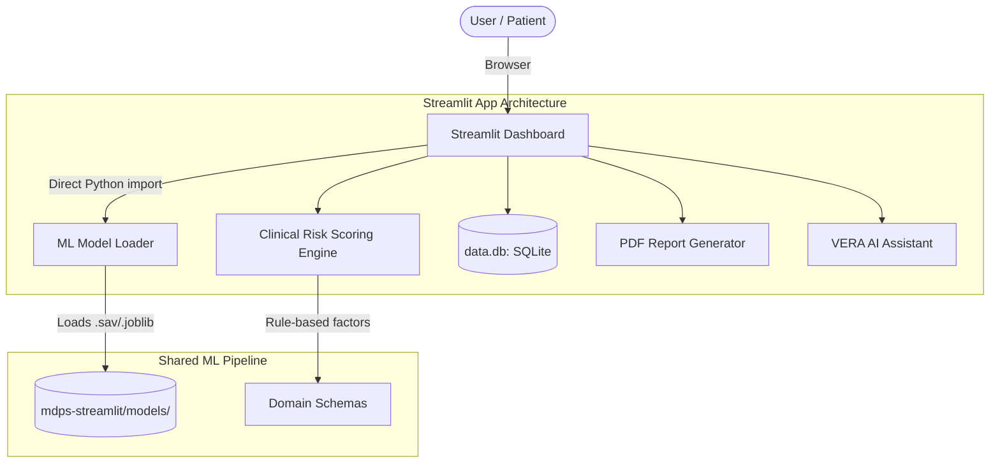

# 🩺 Multiple Disease Prediction System (MDPS)

[](https://python.org)
[](https://streamlit.io)
[](https://scikit-learn.org)
[](https://sqlite.org)
[](https://plotly.com)

An industry-grade, AI-powered digital health screening platform built using **Python, Streamlit, SQLite, and Scikit-Learn**. The **Multiple Disease Prediction System (MDPS)** features a premium Streamlit dashboard, integrating nine specialized clinical screening modules with trained ML models, an intelligent lab report analyzer, a medical facility locator, and an AI clinical assistant (VERA).

---

## 🏗️ System Architecture & Workflow

The platform runs as a Streamlit dashboard, powered by trained ML models and a clinical scoring engine:



---

## 🌟 Key Technical Features

### 1. 🧪 Multi-Disease Numerical Predictive Screening
Nine clinical metrics-based prediction systems:
- **Metabolic / Endocrine**: Diabetes
- **Cardiovascular**: Heart Disease
- **Neurological**: Parkinson's Disease
- **Hepatic**: Liver Disease & Hepatitis
- **Renal**: Chronic Kidney Disease (CKD)
- **Oncology**: Breast Cancer & Lung Cancer
- **General Physiology**: Jaundice

### 2. 🔐 Session Security & Persistence
- **Bcrypt Hashing**: Salt-hashed passwords, no plain-text storage.
- **SQLite Persistence**: User profiles and diagnostic report history.
- **Guest Mode**: Direct access without login, with on-demand save and skip flow.

### 3. 📊 Explainable AI & Analytics
- Per-factor contribution breakdown for every prediction
- Clinical threshold visualization with severity bands
- Downloadable PDF diagnostic reports via `fpdf2`

---

## 📁 Project Structure

```
mdps/
├── .gitignore
├── README.md
├── requirements.txt            # Unified dependencies
├── start.ps1                   # PowerShell launcher
│
└── mdps-streamlit/             # Streamlit app
    ├── app.py                  # Main Streamlit application
    ├── auth.py                 # Authentication module
    ├── code/
    │   ├── DiseaseModel.py     # Symptom-based model loader/trainer
    │   ├── predictors.py       # Numerical model wrappers + UI schemas
    │   └── helper.py           # PDF generation + explainability
    ├── models/                 # Trained ML models (.sav, .joblib)
    ├── datasets/               # Training datasets
    ├── images/                 # Streamlit UI assets
    └── requirements.txt        # Streamlit Cloud deploy deps
```

---

## ⚙️ Installation & Setup

### Prerequisites
- Python 3.9+

### 1. Clone the Repository
```bash
git clone https://github.com/ankitsingathia/MDPS.git
cd MDPS
```

### 2. Install Dependencies
```bash
pip install -r requirements.txt
```

### 3. Run the Streamlit Dashboard
Launch via the PowerShell startup script:
```powershell
powershell -ExecutionPolicy Bypass -File "start.ps1"
```
Or directly via Streamlit:
```bash
cd mdps-streamlit
streamlit run app.py
```
Open [http://localhost:8501](http://localhost:8501) in your browser.

---

## 🧠 Trained Models

Trained ML estimators are loaded from `mdps-streamlit/models/`:

| Clinical Module | Model File | Algorithm |
| :--- | :--- | :--- |
| **Diabetes** | `diabetes.sav` | SVM |
| **Heart Disease** | `heart.sav` | Logistic Regression |
| **Parkinson's** | `parkinsons.sav` | SVM |
| **Liver Disease** | `liver.sav` | SVM |
| **Hepatitis** | `hepatitis.sav` | Random Forest |
| **Lung Cancer** | `lung_cancer.sav` | Random Forest |
| **Kidney Disease** | `kidney.sav` | SVM |
| **Breast Cancer** | `breast_cancer.joblib` | Random Forest |
| **Symptom Prognosis** | `symptom_dt.joblib` | Decision Tree |

---

## ⚖️ Disclaimer

*This application is for educational and research purposes only. It is not intended to provide professional medical diagnoses or replace consultations with licensed healthcare providers.*
