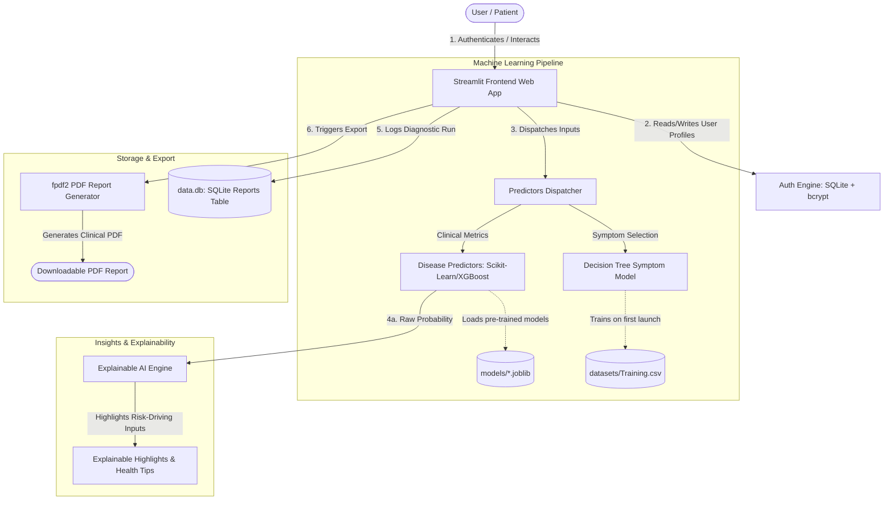

# 🩺 Multiple Disease Prediction System (MDPS)

[](https://python.org)
[](https://streamlit.io)
[](https://sqlite.org)
[](https://scikit-learn.org)
[](https://plotly.com)

An industry-grade, AI-powered digital health screening platform built using **Python, Streamlit, SQLite, and Scikit-Learn**. The **Multiple Disease Prediction System (MDPS)** integrates nine specialized numerical disease screening modules with an auto-trained symptom prognosis engine, custom Explainable AI (XAI) risk analysis, secure user session management, and dynamic PDF report generation.

---

## 🏗️ System Architecture & Workflow

The platform follows a clean separation of concerns, partitioning user authentication, model execution, visual analytics, and document generation:



---

## 🌟 Key Technical Features

### 1. 🔐 Enterprise-Grade Session Security
- **Bcrypt Hashing**: User passwords are salt-hashed using `bcrypt` before storage. No plain-text passwords touch the disk.
- **Robust Schema**: Relational database persistence using **SQLite** (`data.db`) storing user profiles and personal diagnostic report history.
- **Clean Session States**: Fully handles login/logout contexts, ensuring user data privacy.

### 2. 🧪 Multi-Disease Numerical Predictive Screening
Features 9 clinical metrics-based prediction systems:
- **Metabolic / Endocrine**: Diabetes.
- **Cardiovascular**: Heart Disease.
- **Neurological**: Parkinson's Disease.
- **Hepatic**: Liver Disease & Hepatitis.
- **Renal**: Chronic Kidney Disease (CKD).
- **Oncology**: Breast Cancer & Lung Cancer.
- **General Physiology**: Jaundice.

*Each model is decoupled from the main interface via structured predictor schemas mapping UI input constraints directly to scikit-learn/XGBoost features.*

### 3. 🤒 On-the-Fly Symptom Diagnostic Model
- **Auto-Training Pipeline**: On initial launch, the system automatically checks for the symptom-based Decision Tree classifier. If missing, it trains the model on `datasets/Training.csv` and caches it dynamically as `models/symptom_dt.joblib`.
- **Symptom Severity Weighting**: Calculates an overall symptom risk index using severity weights from `symptom_severity.csv`.

### 4. 🔍 Explainable AI (XAI) & Clinical Analytics
- **Risk-Driver Highlight**: Explains prediction results by automatically evaluating input parameters against standard clinical thresholds, indicating which specific factors (e.g., high blood pressure, elevated BMI) contributed to a positive classification.
- **Visual Analytics**: Embeds interactive Plotly dashboards featuring custom health-risk gauge charts and trend metrics.

### 5. 📄 Dynamic Clinical PDF Generator
- Generates professional medical report sheets on-demand using `fpdf2`.
- Includes clinical details, exact inputs, predicted health status, diagnostic warnings, and personalized lifestyle health recommendations.

---

## 📁 Repository Structure

```
MDPS/
├── mdps-streamlit/
│   ├── app.py                  # Streamlit central entry point and UI layout
│   ├── auth.py                 # SQLite schema, user auth operations, & history queries
│   ├── requirements.txt        # PIP dependencies manifest
│   ├── Procfile                # Heroku deployment configuration
│   ├── .streamlit/
│   │   └── config.toml         # Streamlit visual configurations (theming, etc.)
│   ├── code/
│   │   ├── DiseaseModel.py     # Symptom-based Decision Tree trainer/loader
│   │   ├── predictors.py       # Numerical ML model definitions & input UI mapping schemas
│   │   └── helper.py           # PDF report layout generator & XAI logic
│   ├── datasets/               # Reference datasets for symptoms & clinical descriptors
│   │   ├── Training.csv
│   │   ├── symptom_severity.csv
│   │   ├── disease_description.csv
│   │   └── disease_precaution.csv
│   ├── models/                 # Local directory for saving serialized ML models (.joblib, .sav)
│   ├── images/                 # Icon assets and visualization charts
│   └── reports/                # PDF report output buffer directory
└── README.md                   # Project documentation
```

---

## ⚙️ Installation & Setup

### Prerequisites
- Python 3.9, 3.10, or 3.11

### 1. Clone the Repository
```bash
git clone https://github.com/ankitsingathia/MDPS.git
cd MDPS
```

### 2. Install Dependencies
Ensure you install the required packages listed in the `requirements.txt`:
```bash
pip install -r mdps-streamlit/requirements.txt
```

### 3. Setup Models & Datasets
- Ensure that the clinical datasets (`Training.csv`, `symptom_severity.csv`, etc.) are placed inside `mdps-streamlit/datasets/`.
- Pre-trained models should be serialized as `.joblib`, `.sav`, or `.pkl` and stored in `mdps-streamlit/models/`. Feature orders must align with the schemas configured in `mdps-streamlit/code/predictors.py`.

### 4. Run the Streamlit Application
Start the server locally:
```bash
cd mdps-streamlit
streamlit run app.py
```
Open [http://localhost:8501](http://localhost:8501) in your browser.

---

## 🧠 Numerical Models Configuration Mapping

Numerical predictors are configured dynamically. Place your serialized weights in `models/` with the designated filenames:

| Clinical Module | Expected Model Filename |
| :--- | :--- |
| **Diabetes** | `diabetes.joblib` |
| **Heart Disease** | `heart.joblib` |
| **Parkinson's** | `parkinsons.joblib` |
| **Liver Disease** | `liver.joblib` |
| **Hepatitis** | `hepatitis.joblib` |
| **Lung Cancer** | `lung_cancer.joblib` |
| **Chronic Kidney Disease** | `kidney.joblib` |
| **Breast Cancer** | `breast_cancer.joblib` |
| **Jaundice** | `jaundice.joblib` |

---

## 🌟 Software Engineering Best Practices Highlight (For Interviewers)

This project showcases several advanced engineering decisions that go beyond standard data science scripts:

- **Decoupled Configuration Pattern**: UI forms and model features are defined in declarative schemas inside `predictors.py`. Adding a new feature or model does not require editing HTML/UI code; only updating the schema.
- **Robust Exception Handling & Auto-healing**: If a pre-trained `.joblib` model is missing from `models/`, the system remains functional, providing informative warnings or falling back to training the symptom model on demand.
- **Dynamic CSS Injection**: Uses advanced Streamlit UI custom styles, including premium glassmorphism gradients, custom dark/light theme configurations, and custom typography integrations.
- **Optimized SQL Queries**: Built-in SQLite authentication avoids open connection leaks using clean `with sqlite3.connect(...)` contexts and parameterized query syntax to guard against SQL injection.

---

## ⚖️ Disclaimer

*This application is for educational and research purposes only. It is not intended to provide professional medical diagnoses or replace consultations with licensed healthcare providers.*
